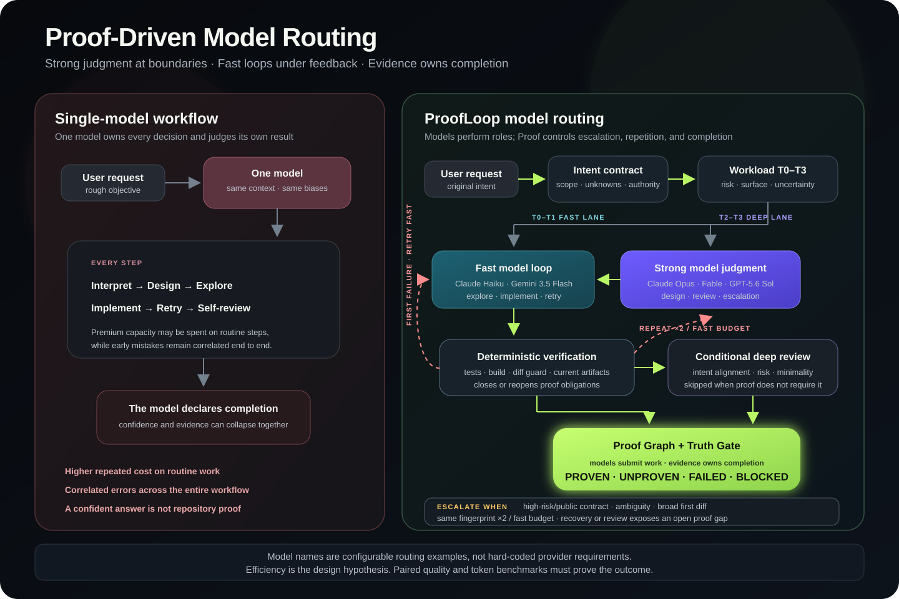

# ProofLoop

**Make coding agents prove they are done.**

> **Strong judgment at the boundaries. Fast models in the loop. Evidence at the finish.**

ProofLoop is a skill-first software-engineering runtime for Codex CLI, Claude Code CLI, and AGY CLI
(the Antigravity integration). One
visible skill turns a rough request into a scope-preserving intent contract, chooses a workload-sized
workflow, runs isolated roles, verifies real repository evidence, repairs bounded failures, and ends in
an explicit truth state.

[한국어 README](README.ko.md)

> **Under active development — `v0.4.0-alpha`.** Adaptive model routing, the Proof Graph, bounded recovery,
> live execution visibility, and per-model token accounting are implemented and covered by deterministic
> tests. Authenticated live evidence and comparative quality/token-efficiency benchmarks are still being
> developed and measured.

## The idea in one minute

Most agent workflows make one model do everything: understand the request, design the change, search the
repository, implement, retry, review itself, and declare success. Using the strongest model for every step
is expensive. Using a fast model for every step can make early misunderstandings compound.

ProofLoop's design bet is different:

```text
rough request
  → strong reasoning at high-leverage decisions, only when the task earns it
  → fast explorer and implementer loops where tests can provide corrective feedback
  → deterministic checks after every meaningful attempt
  → strong independent review when risk, uncertainty, or blast radius requires it
  → evidence—not any model—owns the final verdict
```

In other words: spend premium reasoning where a wrong decision would multiply downstream work. Use faster,
lower-cost models for bounded exploration, implementation, and repair loops that can be corrected by real
feedback. Skip both when a small task does not need them.

This is the product hypothesis behind ProofLoop's model routing and adaptive lanes. The architecture and
deterministic mechanics exist; the claim that this produces better token efficiency is still being tested
and is not presented as a proven result.



The important distinction is not “many models instead of one.” ProofLoop couples routing to the proof
state: failed evidence sends work back through a bounded recovery loop, open high-risk obligations can add
strong review, and closed obligations let the runtime stop. Routing controls who works next; Proof controls
why the loop continues and whether the result may be called complete.

The model names in the diagram are concrete routing examples, not fixed dependencies. A host may route
strong judgment to Claude Opus or GPT-5.6 Sol and feedback-rich implementation loops to Claude
Haiku or Gemini 3.5 Flash. The active Registry, host capability, availability, and observed model trace
remain authoritative.

### When does ProofLoop escalate to a stronger role or model?

Escalation is driven by observed risk and proof gaps, not by a model asking for more intelligence. The
current default policy is:

| Signal | Runtime decision |
| --- | --- |
| Security, auth, payments, permissions, concurrency, migration, schema, data loss, deployment, or another critical path | Enter T3; require strong planning, exploration, independent review, and high-risk proof obligations |
| Public contract, persistent state, greenfield architecture, broad scope, or material uncertainty | Enter or upgrade to T2/T3; add a planner, an explorer when needed, and deep review |
| First diff touches a critical path | Upgrade to T3 even if the request looked simple |
| First diff spans at least three top-level roots or four files | Upgrade an underestimated T0/T1 task to T2 |
| Same deterministic failure fingerprint repeats twice, or the default two fast attempts are exhausted | Switch to the recovery role; upgrade T0/T1 to T2 and require deep review |
| Failure is `DESIGN_CONFLICT`, `SPEC_AMBIGUITY`, or `CONTRACT_CHANGE` | Return to the strong planner instead of retrying implementation |
| Deep reviewer returns `FIX_REQUIRED` or `OVERBUILT` | Run one bounded recovery repair, rerun deterministic checks, then review again |
| Recovery, replan, time, or token budget is exhausted | Stop as `BLOCKED` or `FAILED`; do not escalate forever |

The default repair budget is two fast attempts followed by at most one recovery attempt. Task briefs can
set tighter budgets, and the runtime records every transition and reason in the event stream and artifacts.

#### First-Diff Reclassification & Task Blueprints

Even if a task is initially classified as light (`T0` or `T1`), ProofLoop continuously monitors the implementation boundary. **The First-Diff Guard** automatically upgrades the workload to `T2` or `T3`—and assigns an independent `reviewer`—if the first produced diff touches security, payment, or concurrency boundaries, or expands across more than three roots or four files.

To prevent compounding errors on complex changes, the planner structures work into **dependency-gated task blueprints** (`TASK-1: reproduction test`, `TASK-2: persistence seam`, `TASK-3: verification`). Each task enforces its own allowed paths, protected paths, and stop conditions.

## Why ProofLoop exists

Coding agents are good at producing plausible changes. Plausibility is not completion.

A model can say that tests pass without running them, use stale evidence, quietly widen the scope, keep
repairing without making progress, or spend more tokens on a one-line change than the change is worth.
Prompt discipline helps, but the same model should not own the request, the implementation, the evidence,
and the final verdict without checks and balances.

ProofLoop follows four principles:

1. **Evidence over claims.** Deterministic checks, protected-file integrity, and current artifacts outrank model prose.
2. **The loop belongs to the runtime.** Retry, escalation, recovery, and exhaustion are explicit state transitions, not hopeful prompt text.
3. **Use only the process the work earns.** Small changes take a fast lane; uncertainty, blast radius, and proof gaps add roles and review.
4. **Truth includes restraint.** A correct change can still fail if it is out of scope, overbuilt, or supported only by stale evidence.

## How does that help me?

You give ProofLoop the same kind of request you would give a coding agent. The difference is what happens
afterward: ProofLoop turns the request into an explicit contract, decides how much process the task
deserves, exposes every role and model change, and refuses to collapse “the model sounds confident” into
“the repository is proven.”

| Your task | Likely ProofLoop path | Practical value |
| --- | --- | --- |
| One-file mechanical change | Intent-lite → fast implementation → focused check → truth gate | Avoids paying for a full planning and review ceremony |
| Bounded feature with known seams | Targeted context → fast implementation loop → tests → optional review | Lets objective feedback correct inexpensive iterations |
| Cross-module or ambiguous feature | Strong planning → bounded fast implementation cycles → reclassification → strong review | Uses premium reasoning before and after the high-volume middle |
| Regression or intermittent failure | Failure fingerprint → targeted retry → recovery escalation → fresh verification | Continues without requiring you to manually re-prompt every failed attempt |
| Security, migration, or public-contract change | High-risk lane → explicit proof obligations → independent review → fail-closed truth | Prefers `BLOCKED` or `UNPROVEN` over an unsafe success claim |

ProofLoop is most useful when a task is large enough for mistakes to compound, when failed checks are
likely, or when accepting a wrong result is expensive. It is less useful for prose edits, trivial renames,
or repositories with no executable checks. The Adaptive lane is designed to reduce that overhead, but its
real-world efficiency advantage remains unproven until paired benchmarks complete.

Distinct-model routing also depends on the host. Codex and Claude Code can request role-specific models;
the current Antigravity integration isolates roles but uses the current session model.

### Bounded Recovery via Failure Fingerprints

When a check fails during implementation, ProofLoop does not blindly instruct the model to "try again." It constructs a **Failure Fingerprint** (`category + signature`) from the failure output to govern systematic recovery:

- **Targeted Fast Retries:** Up to two fast attempts allowed for local code and test fixes (`implementer_fast`).
- **Recovery Controller Escalation:** If the exact same failure fingerprint repeats across attempts, naive retries are halted. Work switches to a dedicated `recovery` role with historical contradiction analysis.
- **Structural Re-planning:** If the fingerprint reveals `DESIGN_CONFLICT`, `SPEC_AMBIGUITY`, or `CONTRACT_CHANGE`, work is routed back up to the strong planner (`planner_deep`) instead of burning tokens on implementation retries.
- **Budget Exhaustion:** Every run operates within explicit token and retry budgets (`Budgeted Tokens`). When limits are reached, the run terminates honestly as `FAILED` or `BLOCKED` with full evidence history.

## Getting started

### Requirements

- macOS or Linux with Python 3.10+
- Git
- At least one supported host CLI: `codex`, `claude`, or `agy` (Antigravity)
- npm only for the pinned local tokScale companion

### Install

```bash
git clone https://github.com/anjwoc/ProofLoop.git
cd ProofLoop
./install.sh
python3 scripts/doctor.py
```

Equivalent entry points are available:

```bash
make install
python3 scripts/install.py
python3 script/install.py
npm run proofloop:install
```

Installation is a clean, idempotent reinstall of ProofLoop-managed files. It removes stale ProofLoop
runtime, plugin, skill, agent, workflow, and marketplace entries before installing the current build.
Unrelated host configuration is preserved. The install manifest is written to
`~/.proofloop/install-manifest.json`.

Restart the host after installation, then invoke the one public skill:

```text
Codex:       $proofloop <request>   or choose proofloop from /skills
Claude Code: /proofloop <request>
Antigravity: /proofloop <request>
```

### First useful task

Start in a clean, disposable Git repository with a real success command. For example:

```text
/proofloop Add an idempotent reservation endpoint with persistence, conflict handling,
and tests. Preserve the existing response contract. Run the repository's tests and do
not report completion unless the checks and final diff are proven.
```

In another terminal, follow the same run:

```bash
proofloop-core watch --run latest --repo . --format human
```

After completion, inspect the truth and usage artifacts:

```bash
proofloop-core usage --run latest --repo . --reconcile
python3 -m json.tool .proofloop/runs/<run-id>/truth-report.json
```

## How ProofLoop Works: The Five-Stage Proof Pipeline

ProofLoop processes every engineering request through an immutable, verification-first pipeline:

1. **Intent & Grounding (Wave 0):**
   - The raw user request is frozen (`request-envelope.json`).
   - ProofLoop inspects the repository (`AGENTS.md`, `pyproject.toml`, Git status, CodeGraph boundaries) before asking any questions, extracting exact framework boundaries, existing test commands, and protected user files.

2. **Grounded Prompt Compilation & Reconciliation:**
   - A meta-compiler transforms the objective, repository facts, and authority boundaries into a structured `Prompt IR (v1)`.
   - **The Intent Reconciler Guard** inspects the contract before execution. If a model hallucinates unauthorized side effects (e.g., production deployment, creating PRs) or weakens proof requirements, the run is blocked or repaired immediately.

3. **Adaptive Routing & Blueprinting:**
   - Workloads are classified into tiers (`T0` to `T3`) based on complexity, uncertainty, risk, and blast radius.
   - Tasks are broken down into dependency-gated blueprints (`TASK-1`, `TASK-2`, etc.) with strict allowed/protected path constraints.

4. **Isolated Role Execution & Live In-Chat Relay:**
   - Specialized roles (`explorer`, `planner`, `implementer`, `reviewer`) are dispatched with model-specific rendered prompts (`gpt56-outcome-v1`, `claude-review-v1`).
   - The **In-Chat Relay (`proofloop-core relay`)** streams observed role, model, phase, check, and recovery events directly into your host CLI session (AGY, Claude Code, or Codex) without exposing private provider reasoning (`thinking` redaction).

5. **Truth Engine & Evidence Verdict:**
   - No completion claim is accepted without evidence. The deterministic kernel verifies parent-owned checks, diff scope integrity, and test non-weakening.
   - Outputs an authoritative verdict: `PROVEN`, `PARTIAL`, `FAILED`, or `BLOCKED`.

The runtime exposes three user modes:

| Mode | Use it for | Behavior |
| --- | --- | --- |
| `adaptive` | Default engineering work | Chooses the lightest workflow justified by workload and proof gaps |
| `goal` | Multi-step convergence work | Continues until the goal is proven, exhausted, or genuinely blocked |
| `audit` | Read-only analysis | Produces evidence without authorizing source mutation |

```bash
proofloop-core run --mode adaptive --host codex --repo . --request-file request.txt
proofloop-core run --mode goal --host claude-code --repo . --request-file request.txt
proofloop-core run --mode audit --host codex --repo . --request-file audit.txt
```

## Visible execution, model changes, and artifacts

The human stream shows phases, role starts, requested and observed models, model changes, attempts, check
results, recovery reasons, review findings, token progress, and the final truth state. An unobserved model
is displayed as requested-only and keeps model routing `UNPROVEN`.

Each run persists machine-readable artifacts under `.proofloop/runs/<run-id>/`, including:

- `intent-contract.json`
- `workload-profile.json`
- `proof-graph.json`
- `skill-resolution.json` and `domain-selection.json`
- `events.jsonl`, `model-trace.jsonl`, and `invocations/`
- `attempts.jsonl`, check outputs, and diff evidence
- `usage/usage-summary.json`
- `truth-report.json`

JSONL output is available for TUI, relay, and CI consumers:

```bash
proofloop-core run --mode adaptive --host codex --repo . --request-file request.txt \
  --output-format jsonl
```

When a host skill starts a detached run, it uses the same human event stream
to keep the initiating Codex, Claude Code, or AGY conversation informed:

```bash
proofloop-core relay --relay-dir .proofloop/relay/<relay-id> --wait-seconds 3
```

`relay` prints only newly appended observable lines—phase, role, requested or
observed model, tool/check status, recovery, review, budget, and verdict—then
returns `PROOFLOOP_RELAY_ACTIVE` or `PROOFLOOP_RELAY_FINISHED`. It deliberately
does not reveal private provider reasoning or raw provider transcripts. Hosts
must make repeated short relay calls while the parent run is active; a child
process cannot independently push text into a host chat transcript.

### Mechanical Verification: The Expected Output Contract

Every completed run emits `expected-output-report.json`, a mechanical audit verifying that the runtime observed strict proof and observability discipline across 10 checkpoints:

1. `repository_binding`: Run, request envelope, and grounding snapshot point to the exact target repository root.
2. `immutable_request`: Raw user request and SHA-256 hash are preserved without alteration.
3. `intent_and_authority_visibility`: IntentGate authority classifications are recorded and emitted.
4. `refined_intent_contract`: Objectives, observable acceptance criteria, and authority boundaries are inspectable.
5. `grounding_wave_zero`: Preflight facts and verified test commands are retained.
6. `strategy_and_execution_brief`: Workload tier (`T0-T3`) and scoped brief are documented.
7. `observable_role_progress`: Active phase transitions and rendered prompt IRs are inspectable.
8. `model_trace_honesty`: Requested vs. observed model traces are recorded without false claims.
9. `private_reasoning_redacted`: All host logs have provider private reasoning/thinking blocks completely scrubbed.
10. `evidence_backed_truth_verdict`: The terminal `PROVEN`, `PARTIAL`, `BLOCKED`, or `FAILED` verdict is backed by concrete check, diff, review, and token usage artifacts.

You can mechanically audit any run yourself using:
```bash
python3 scripts/verify_expected_output.py .proofloop/runs/<run-id> --require-terminal
```

## ProofLoop, Superpowers, and ordinary skills

[Superpowers](https://github.com/obra/superpowers/tree/d884ae04edebef577e82ff7c4e143debd0bbec99)
is a mature, composable software-development methodology. Its public workflow mandates brainstorming,
worktrees, plans, TDD, subagent execution, review, and completion verification. ProofLoop shares its
commitment to systematic work and evidence, but is solving a different runtime problem.

| Dimension | Ordinary single skill | Superpowers | ProofLoop |
| --- | --- | --- | --- |
| Primary unit | Domain instructions in model context | Composable mandatory workflow skills | One public entry skill backed by a runtime and internal protocols |
| Workflow ownership | The active model | Skill instructions and host tools | Runtime FSM, proof graph, budgets, and host adapters |
| Workload adaptation | Usually manual | Workflow is intentionally comprehensive | T0–T3 fast/full lanes with first-diff reclassification |
| Verification | Depends on the skill and model | Verification-before-completion discipline | Deterministic commands, evidence authority, diff guard, and truth gate |
| Recovery | Re-prompt or skill-specific debugging | Systematic-debugging workflow | Failure fingerprints, bounded retries, recovery role, exhaustion state |
| Model routing | Host default | Host/subagent dependent | Role registry plus requested/observed model trace |
| Token accounting | Usually absent | Not a core public claim | Per run/task/role/model/invocation ledger plus tokScale reconciliation |
| Domain knowledge | Often the main value | Primarily process methodology | Generic domain packs with repository-conditioned technology adapters |
| Completion output | Natural-language answer | Workflow completion discipline | `PROVEN`, `UNPROVEN`, `FAILED`, or `BLOCKED` with artifacts |

This table describes architecture, not a proven performance ranking. There is currently no completed,
controlled benchmark showing that ProofLoop beats Superpowers in pass rate or tokens. Superpowers also
maintains behavior tests; comparing the two fairly requires the same tasks, model, host, time limit,
repository state, and external evaluator.

## What is actually proven today

Evidence labels are intentionally narrow:

| Claim | Current evidence | Status |
| --- | --- | --- |
| Deterministic kernel and package mechanics | 209 local tests pass; package validation passes | `DEVELOPMENT_PROVEN` |
| Simulated one-command orchestration | Fake-host process and orchestration tests | `SIMULATED_MECHANICS_PROVEN` |
| Trigger routing for five authoring fixtures | Positive/negative fixtures, all F1 1.0 | `AUTHORING_SET_ONLY` |
| External trigger routing | Pinned SWE-Skills-Bench titles: backend/frontend/devops F1 1.0 | `LIMITED_EXTERNAL_MEASURED` |
| Test-engineering and code-review external routing | No external catalog coverage | `UNMEASURED` |
| Domain-pack behavior | 90 paired trials planned, not executed | `PLANNED` |
| Six-arm SWE efficacy benchmark | 162 trials dry-run; Docker evaluator not completed | `UNMEASURED` |
| Authenticated cross-model routing and recovery | No accepted live run artifact | `UNPROVEN` |
| Token-efficiency or market superiority | No completed paired model benchmark | `UNPROVEN` |

The machine-readable qualification report is
[`reports/domain-skill-qualification.json`](reports/domain-skill-qualification.json). The release report is
[`reports/release-check.json`](reports/release-check.json). Dry-run and self-authored fixtures are never
reported as task pass-rate evidence.

## Domain packs are experimental

ProofLoop currently ships five generic domain packs:

- backend development
- frontend development
- DevOps delivery
- test engineering
- code review

Django, React, Spring, GitHub Actions, Kustomize, Flux, and similar names are conditional adapters inside
generic packs, not public product skills. All five packs remain `EXPERIMENTAL` and are excluded from default
Adaptive selection until repeated behavior and efficacy scorecards justify promotion.

Use explicit canary opt-in only:

```bash
proofloop-core run --mode adaptive --host codex --repo . --request-file request.txt \
  --experimental-domain-packs
```

## Token usage and reproducible benchmarks

Provider-reported input, output, cache-read, cache-write, and reasoning tokens are attributed to the exact
run, task, role, model, session, and invocation. Missing usage remains unknown and invalidates efficiency
claims; it is never converted to zero.

```bash
proofloop-core usage --run latest --repo .
proofloop-core usage --run-dir .proofloop/runs/<run-id> --reconcile
```

The benchmark harness supports six paired arms:

1. single model, no skill
2. single model, ProofLoop domain pack only
3. single model, official external skill
4. ProofLoop Core without skill resolution
5. Adaptive ProofLoop
6. Full ProofLoop

The harness records pinned repositories, read-only official tests, Docker evaluation, usage coverage,
repetition requirements, and adoption gates in its benchmark artifacts.

`scripts/run_benchmarks.sh` is safe by default: it only writes a dry-run schedule. It never starts an
authenticated model experiment unless `--execute` and an explicit baseline model are supplied.

```bash
# Safe schedule only (no model CLI is invoked)
bash scripts/run_benchmarks.sh --reservation

# Explicit, cost-bearing experiment after reviewing the schedule and budget
bash scripts/run_benchmarks.sh --reservation --execute \
  --baseline-host codex --baseline-model <baseline-model>
```

## Testing in Codex, Claude Code, and Antigravity

Referencing only the public ProofLoop skill and asking it to build something is a valid end-to-end smoke
test on all three hosts, as long as the task is inside a real Git repository and has executable checks. It
tests the entry skill, runtime launch, event stream, artifacts, checks, and truth gate.

| Host | Invoke | What the smoke test can show | Model-routing boundary |
| --- | --- | --- | --- |
| Codex | `$proofloop <request>` or `/skills` | Full runtime path, live events, checks, recovery, artifacts, truth | Role-specific models can be requested; only an observed model trace proves they were used |
| Claude Code | `/proofloop <request>` | Full runtime path, live events, checks, recovery, artifacts, truth | Role-specific models can be requested; only an observed model trace proves they were used |
| Antigravity | `/proofloop <request>` | Full runtime path with role-isolated Antigravity processes | `ROLE_ROUTING_ONLY`; roles use the current session model |

### Honest Model Trace & Capability Accounting

ProofLoop enforces strict reporting contracts across hosts:
- **Codex & Claude Code:** Support requesting role-specific models. However, requested model names are never treated as proof; only an observed model trace (`observedModel`) confirmed by API execution headers or logs proves that a specific model was used.
- **Antigravity (AGY CLI):** Operates in `ROLE_ROUTING_ONLY` mode using the current session model. ProofLoop records this honestly as `CLI_REQUESTED_ONLY` with candidate substitutions rather than falsely claiming independent multi-model execution.

Use the same meaningful test standard on every host:

1. Restart the host after installation.
2. Use a disposable Git repository with a green baseline.
3. Request a project-sized task with tests, persistence, error handling, and a compatibility constraint.
4. Keep another terminal on `proofloop-core watch --run latest --repo . --format human`.
5. Verify `truth-report.json`, `model-trace.jsonl`, check artifacts, final diff, and usage coverage.
6. Run a second scenario containing a real failing check to observe bounded recovery; first-attempt success does not prove recovery.

Example invocations:

```text
# Codex
$proofloop Add an idempotent reservation API with persistence, conflict handling, and regression tests.

# Claude Code
/proofloop Add an idempotent reservation API with persistence, conflict handling, and regression tests.

# Antigravity
/proofloop Add an idempotent reservation API with persistence, conflict handling, and regression tests.
```

The authenticated acceptance harness supports all three host CLIs. A successful run produces a retained
host transcript plus the parent-owned ProofLoop artifacts; it does not by itself prove a requested model unless
the run's model trace contains an observation.

```bash
python3 scripts/run_host_live.py --host codex --scenario normal --keep-workspace
python3 scripts/run_host_live.py --host codex --scenario recovery --keep-workspace
python3 scripts/run_host_live.py --host claude-code --scenario normal --keep-workspace
python3 scripts/run_host_live.py --host claude-code --scenario recovery --keep-workspace
python3 scripts/run_host_live.py --host antigravity --scenario normal --keep-workspace
python3 scripts/run_host_live.py --host antigravity --scenario recovery --keep-workspace
python3 scripts/release_check.py
```

The Claude Code harness loads the generated local plugin only for that disposable invocation through
`--plugin-dir`; it does not rely on a pre-existing globally installed plugin. Run it in an authenticated
environment to create actual normal/recovery evidence before making any release claim.

Antigravity permission bypass remains off by default. Enable
`PROOFLOOP_ANTIGRAVITY_BYPASS_PERMISSIONS=1` only in an isolated unattended test environment.

## Release boundary

Before a public launch, the project still needs:

- authenticated host acceptance artifacts
- completed behavior and paired efficacy trials
- Docker-backed official evaluator results
- a selected and committed software license; this repository currently has no `LICENSE` file
- CI that republishes the same evidence on a clean machine

Until those gates close, market copy should say “designed to improve reliability and token efficiency,”
not “proven better” or “saves N%.”
