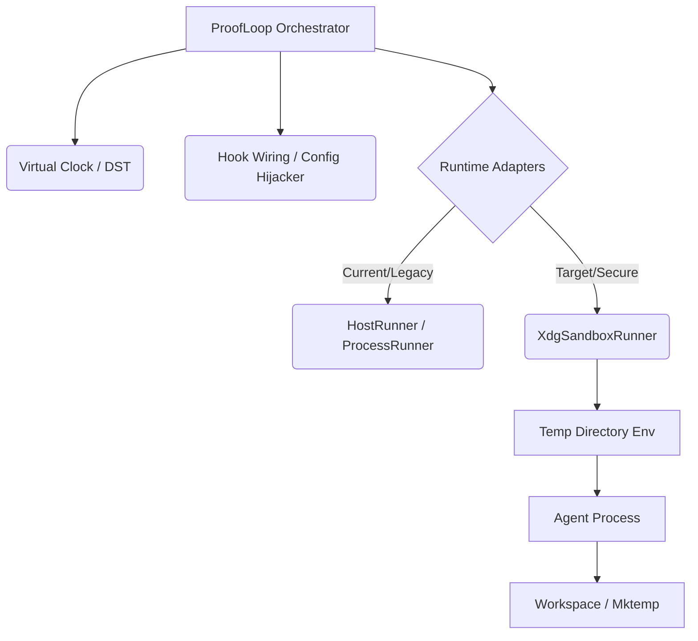

# ProofLoop Harness Engineering Architecture

## 1. Overview
Harness Engineering is the paradigm of confining, simulating, and validating AI agent interactions within highly controlled environments. This document outlines the target architecture for ProofLoop to support deterministic simulation and execution isolation, adopting industry standards seen in state-of-the-art frameworks like OpenHands, SWE-agent, and oh-my-openagent.

## 2. Core Pillars of the Harness

### 2.1 Deterministic Simulation (Virtual Clock)
AI agents are non-deterministic. To enable reproducible debugging and trace replay, ProofLoop implements Deterministic Simulation Testing (DST).
- **Virtual Clock**: Overrides the system clock (`time.time()`) during simulation modes.
- **Seeded Randomness**: Pins all stochastic processes.
- **Epoch Waiters**: Manages multi-agent execution steps in discrete, order-stable epochs rather than relying on real-time thread scheduling.

### 2.2 Execution Isolation (XDG Environment Sandbox)
Running agents directly on the host machine (`HostRunner`/`ProcessRunner`) introduces unacceptable risks of workspace corruption and side-effects.
- **XdgSandboxRunner**: A new execution adapter in `proofloop_core/runtimes/`.
- **Ephemeral Temp Directories**: Every agent session spawns a disposable `mktemp` directory for its configuration and state.
- **XDG Hijacking**: Forces external agents to use the temp directory by overriding `XDG_CONFIG_HOME`, `XDG_DATA_HOME`, `XDG_CACHE_HOME`, and `XDG_STATE_HOME`.
- **Zero Infrastructure**: Achieves strict filesystem isolation for testing without requiring Docker or any external daemon.

### 2.3 Dynamic Environment Wiring (Configuration Hijacking)
To act as a true harness for external agents (like Claude Code, Cursor, Aider), ProofLoop must be able to dynamically inject itself into their lifecycle.
- **Configuration Overrides**: Automatically overriding `.cursor/environment.json` or `.claude/settings.json` at startup.
- **Setup/Cleanup Hooks**: Forcing the external agents to execute predefined initialization and teardown scripts to maintain environment hygiene.
- **Chaos Injection**: Deliberately injecting network latency, API failures, or tool errors to test the agent's resilience (Chaos Engineering).

## 3. Component Architecture

## 4. Implementation Phasing
- **Phase 1**: Implement `VirtualClock` and integrate it into `context/io.py`.
- **Phase 2**: Implement `XdgSandboxRunner` in `runtimes/xdg_sandbox_runner.py` with XDG env hijacking.
- **Phase 3**: Implement Dynamic Configuration Wiring for specific agents in `engine/orchestrator.py`.

## 5. Recent Simplifications
To maintain a "ponytail" compliant architecture (simplest solution that actually works), ProofLoop has recently undergone several simplifications:
- **Test Framework Migration**: Replaced legacy `unittest` with `pytest` for streamlined setup and modern fixtures.
- **MCP Integration**: Deprecated custom standard I/O host adapters in favor of native MCP (`FastMCP`). The tools, resources, and lifecycle are now managed via MCP, making agent integration robust and standard-compliant.
- **Renderer Abstraction Removal**: Eliminated `GenericV1Renderer` and the `RendererRegistry` class hierarchies. Prompt generation is now a single `render_prompt` function.
- **GoalFSM Removal**: Removed rigid FSM classes in favor of simple linear string tracking directly in the `orchestrator.py` core loop.
