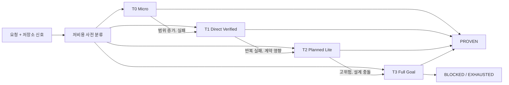

# ProofLoop 효율화 전략: 고정 풀 루프에서 위험 적응형 하네스로

작성일: 2026-07-15  
근거: ProofLoop 자체를 대상으로 수행한 단순, 계획형, Recovery, 고위험 작업 비교 보고서

## 1. 결론

ProofLoop가 모든 작업에서 단일 모델보다 빠르고 저렴해야 한다는 목표는 잘못된 목표다. 한 줄 수정처럼 정답이 명확한 작업에는 역할 분리, 계획, 격리 리뷰, 복구 루프의 고정비가 결과의 가치보다 크다.

ProofLoop의 제품 정의는 다음과 같이 바뀌어야 한다.

> ProofLoop는 모든 작업을 풀 루프로 실행하는 도구가 아니라, 작업의 위험과 불확실성에 맞춰 필요한 검증만 추가하고 실패할 때 자동으로 상위 티어로 승격하는 위험 적응형 엔지니어링 하네스다.

성공 기준도 “모든 작업에서 토큰 절감”이 아니다.

- 단순 작업은 단일 모델에 가까운 비용과 시간으로 끝낸다.
- 일반 계획형 작업은 계획이 실제로 필요할 때만 고성능 모델을 사용한다.
- 실패하거나 위험한 작업은 Recovery, 독립 리뷰, Truth Gate로 사람의 재프롬프트와 회귀 유출을 줄인다.
- 평가는 `성공한 작업당 토큰`, `사람 개입 횟수`, `회귀 유출률`을 함께 본다.

보고서에서 관찰된 탐색 단계 631,334 토큰과 160초 이상의 지연은 안전을 위한 정상 비용이 아니다. 단순 작업 티어 선택 실패, 실행 예산 부재, 산출물 계약 충돌이 결합된 운영 실패로 분류해야 한다.

## 2. 테스트 보고서 해석

| 작업 유형 | 단일 모델 우위 | ProofLoop 우위 | 제품 판단 |
| --- | --- | --- | --- |
| 단순 | 즉시 구현, 낮은 지연과 토큰 | 현재는 사실상 없음 | 풀 루프 금지, fast lane 처리 |
| 일반 계획형 | 범위가 명확하면 빠르고 저렴함 | 실제 설계 선택지가 있을 때 계획 품질 | explorer/planner/reviewer 조건부 호출 |
| Recovery | 실패 후 사람이 다시 지시 | 실패 지문, 재시도, 모델 전환, 자동 검증 | 핵심 차별점 |
| 고위험 | 빠르지만 누락과 회귀를 통과시킬 수 있음 | 변경 예산, 독립 리뷰, Truth Gate, 보수적 BLOCKED | 높은 비용을 정당화하는 핵심 시장 |

ProofLoop의 가치는 모델을 많이 호출하는 데 있지 않다.

1. 실패를 기계적으로 감지하고 다음 행동을 결정한다.
2. 구현자의 자기평가와 독립된 증거로 완료를 판정한다.
3. 실패 비용이 큰 작업에만 강한 모델과 검증을 투입한다.

### 2.1 증거 수준에 대한 주의

이 보고서는 방향 결정에는 사용할 수 있지만 최종 성능 판정으로 사용하면 안 된다. 현재 자료에는 실제 관찰, 추정, 시뮬레이션이 함께 들어 있기 때문이다. 이를 제품 의사결정에 사용하려면 아래의 Evidence Protocol을 적용해야 한다.

#### 2.1.1 먼저 주장을 분리한다

“ProofLoop가 효율적이다”라는 하나의 문장을 검증하지 않는다. 다음처럼 반증 가능한 주장으로 나눈다.

| Claim ID | 주장 | 현재 증거 | 다음에 필요한 증거 |
| --- | --- | --- | --- |
| C-MICRO-01 | micro에서 Adaptive ProofLoop 비용은 단일 fast의 허용 범위 안이다 | 실제 1회 결과는 반대 | fast lane 구현 후 paired pilot |
| C-PLAN-01 | planned에서 ProofLoop는 단일 frontier보다 `costPerProven`이 낮다 | 일부 예상값 | 독립 과제 반복 실측 |
| C-REC-01 | recovery에서 사람 개입을 줄인다 | 시뮬레이션 | 실패가 주입된 과제의 반복 실측 |
| C-RISK-01 | high-risk에서 critical regression 유출을 줄인다 | 시뮬레이션 | 외부 verifier와 fault injection |
| C-HARNESS-01 | 하네스 자체 오류가 작업 실패를 만들지 않는다 | artifact 실패 1회 관찰 | 호스트별 reliability suite |

각 claim은 독립적으로 `SUPPORTED`, `NOT_SUPPORTED`, `INCONCLUSIVE` 중 하나를 가진다. 한 workload의 성공으로 다른 workload까지 일반화하지 않는다.

#### 2.1.2 Evidence Level

| Level | 정의 | 허용되는 의사결정 |
| --- | --- | --- |
| E0 Hypothesis | 시뮬레이션, 직관, 예상 시간 | backlog에 실험 추가 |
| E1 Reproduced | 같은 조건에서 재현된 실제 1~2회 | 버그 확인, 원인 조사 시작 |
| E2 Controlled Pilot | workload당 최소 3개 과제, 과제당 3회 paired trial | 실험 기능 기본값 후보 선정 |
| E3 Release Evidence | 아래 release 표본과 95% paired CI 충족 | 기본 라우팅 정책 변경 |
| E4 Production Evidence | 30일 이상 실제 작업, 최소 30건, 회귀·비용 추적 | stable 정책 및 예산 보정 |

현재 보고서의 단순 작업 BLOCKED는 E1이다. 계획형 비용은 E0~E1, Recovery와 high-risk 우위는 E0에 해당한다. 따라서 지금 바로 “ProofLoop가 recovery에서 우월하다”고 결론 내릴 수 없고, 해당 가설을 E2 이상으로 올리는 실험이 필요하다.

#### 2.1.3 모든 trial이 공유해야 하는 측정 계약

다음 항목이 다르면 같은 비교에 넣지 않는다.

- 동일 task prompt와 prompt hash
- 동일 baseline commit과 verifier hash
- 동일 모델의 정확한 model ID/version, reasoning 설정, access mode
- 동일 timeout, 최대 호출 수, 토큰 budget
- 깨끗한 worktree와 새 채팅 세션
- 동일 host CLI와 ProofLoop commit
- 동일 외부 acceptance checks
- 실행 순서 무작위화와 arm별 동일 머신 조건

trial manifest에는 최소 다음을 저장한다.

```json
{
  "taskId": "micro-logging-01",
  "workload": "micro",
  "arm": "adaptive-proofloop",
  "baselineCommit": "...",
  "promptHash": "...",
  "verifierHash": "...",
  "model": "...",
  "hostVersion": "...",
  "proofloopCommit": "...",
  "timeoutSeconds": 180,
  "tokenBudget": 60000,
  "order": 7,
  "repetition": 3
}
```

#### 2.1.4 성공과 비용 정의

모델의 최종 메시지나 ProofLoop 내부 verdict만으로 성공을 판정하지 않는다.

- **PROVEN**: 외부 acceptance check 전부 통과, 보호 경로 위반 없음, critical regression 없음
- **FAILED_PRODUCT**: 구현 결과가 외부 check를 통과하지 못함
- **FAILED_HARNESS**: artifact, adapter, 권한, parser, orchestration 오류
- **FAILED_ENVIRONMENT**: 모델 API 장애, 머신 디스크 부족, 외부 서비스 장애처럼 제품 밖 원인
- **BUDGET_EXHAUSTED**: 정해진 시간/토큰/호출 예산 안에 증명하지 못함

비용은 하나의 token 숫자로 뭉치지 않는다.

- `rawTokens`: input + output + cache read/write + reasoning
- `billableTokens` 또는 provider 비용
- `wallClockSeconds`
- `modelInvocations`
- `humanInterventions`: 최초 요청 이후 사람이 추가한 지시 수
- `tokensPerProven = 전체 유효 rawTokens / PROVEN 수`
- `costPerProven = 전체 유효 비용 / PROVEN 수`

token coverage가 1.0이 아니거나 tokScale/provider reconciliation이 허용 오차를 넘으면 token 효율 계산에서 0으로 넣지 않고 `USAGE_INCOMPLETE`로 처리한다.

#### 2.1.5 하네스 실패를 숨기지 않는 이중 분석

두 결과를 동시에 낸다.

1. **ITT(Intent-to-treat)**: 예약된 모든 trial을 포함한다. `FAILED_HARNESS`와 `BUDGET_EXHAUSTED`도 실패로 계산한다. 사용자가 실제로 체감하는 제품 성능이다.
2. **Per-protocol**: 동일 조건과 완전한 usage telemetry를 가진 trial만 사용한다. 모델 라우팅 자체의 토큰 효율을 분석한다.

예를 들어 `EXPLORATION_ARTIFACT_MISSING` trial을 per-protocol token 비교에서 제외할 수는 있지만 ITT 성공률에서는 반드시 실패로 남긴다. 제외 사유와 건수도 보고해야 한다.

#### 2.1.6 현실적인 단계별 표본

처음부터 비싼 100회 실험을 돌리지 않는다. 단계별 stop rule을 둔다.

| 단계 | 표본 | 목적 | 다음 단계 조건 |
| --- | --- | --- | --- |
| S0 Instrumentation | 대표 2과제 × arm별 1회 | manifest, usage, verifier 정확성 확인 | usage coverage 100%, harness 오류 원인 식별 |
| S1 Pilot | workload당 3과제 × 3회 | 큰 손해·큰 이득과 분산 확인 | 치명적 회귀 0, 측정 기준 고정 |
| S2 Release Gate | 아래 workload별 표본 | 기본 정책 변경 판단 | workload별 게이트 충족 |
| S3 Production | 30일, 실제 작업 30건 이상 | 분포 변화와 실제 사람 개입 확인 | E4 승격 또는 정책 rollback |

S2 권장 표본은 비용에 따라 다르게 한다.

- micro/small: 각 8개 독립 과제 × 5회 = 40 paired observations
- planned/recovery: 각 5개 독립 과제 × 5회 = 25 paired observations
- high-risk/greenfield: 각 3개 독립 과제 × 5회 = 15 paired observations

95% paired bootstrap CI가 판단 경계를 넓게 가로지르면 `INCONCLUSIVE`로 두고 해당 workload만 최대 10회까지 반복을 늘린다. 효과가 없는 결과를 반복 횟수로 억지로 유의하게 만들지 않는다.

#### 2.1.7 workload별 채택 기준

실패율이 매우 낮은 micro 작업에서 40회만으로 2%p 비열등을 통계적으로 증명하는 것은 현실적이지 않다. 따라서 게이트를 둘로 나눈다.

- **운영 게이트**: 제한 rollout 또는 experimental default를 켤 수 있는 최소 안전 조건
- **주장 게이트**: “통계적으로 개선됐다”고 문서화할 수 있는 조건. paired 95% CI가 경계를 통과해야 한다.

S2 표본으로 운영 게이트만 통과하고 CI가 넓다면 정책은 experimental로 배포하되 claim은 `INCONCLUSIVE`와 E2에 남긴다. E4 production 표본이 쌓인 뒤 stable과 통계적 비열등을 판단한다.

| Workload | S2 운영 품질 게이트 | 효율 게이트 | 안정성 게이트 |
| --- | --- | --- | --- |
| micro | 40 paired trial에서 Adaptive만 실패한 candidate-only failure 0 | token ratio 상한 1.5, median latency ratio 상한 2.0, p95 60초 이하 | `FAILED_HARNESS` 0 |
| small | candidate-only failure 1건 이하, critical regression 0 | `tokensPerProven` ratio 1.15 이하 | 잘못된 T0/T1 분류로 critical miss 0 |
| planned | 단일 frontier보다 실패가 많지 않고 외부 criterion score가 낮지 않음 | `costPerProven` 10% 이상 감소 또는 같은 비용에서 성공률 10%p 이상 증가 | 잘못된 승격/과승격률 20% 이하 |
| recovery | 단일 모델 대비 성공률 10%p 이상 증가 또는 사람 개입 50% 이상 감소 | `costPerProven` ratio 1.25 이하 | 같은 fingerprint 무한 반복 0 |
| high-risk | critical escape 0, 단일 frontier보다 candidate-only critical failure 0 | 절대 budget 안에서 종료 | 위험 신호 false-negative 0 |
| greenfield | 외부 필수 criterion 전부 통과, 총 기능 점수가 낮지 않음 | frontier 대비 `costPerProven` 개선 | timeout/harness 오류율 5% 이하 |

통계적 비열등과 효율 개선 주장은 paired 95% CI로 판단한다. CI가 게이트 양쪽을 모두 포함하면 `INCONCLUSIVE`다. 표본이 작을 때 단순 평균이나 “실패 0건”만 보고 `IMPROVED`라고 주장하지 않는다.

#### 2.1.8 보고서가 최종적으로 답해야 하는 질문

- 어떤 workload에서 crossover가 발생하는가?
- 이득이 모델 라우팅 때문인가, 자동 retry/review 때문인가?
- 실패는 product, harness, environment 중 어디에서 발생했는가?
- ProofLoop가 줄인 사람 개입 시간이 추가 모델 비용보다 큰가?
- 결과가 특정 모델이나 특정 과제 하나에만 의존하는가?

이 질문에 답하지 못하면 해당 claim은 E3로 승격하지 않는다.

## 3. 현재 구현의 대응 수준

현재 `proofloop_core/strategy.py`가 전략을 분류하고 `proofloop_core/orchestrator.py`가 실행 경로를 구성한다.

- `DIRECT_VERIFIED_CHANGE`
- `PLANNED_IMPLEMENTATION`
- `HIGH_RISK_ENGINEERING`
- `REPOSITORY_ANALYSIS`

`DIRECT_VERIFIED_CHANGE`는 planner와 explorer를 생략하고 `implementer_fast`가 TaskBrief 작성과 구현을 한 번에 수행한다. deterministic check, diff guard, 실패 지문, fast/recovery 시도 예산도 존재한다. fast path와 bounded recovery의 뼈대는 이미 있다.

하지만 작업량 적응형 대응은 아직 불완전하다.

1. **분류가 요청 문자열에 과도하게 의존한다.**
   - `typo`, `one-line`, `single file`, `오타`, `한 줄`, `단순 수정` 같은 표현과 500자 미만 조건으로 direct를 선택한다.
   - 실제 영향 파일 수, caller 수, 공개 계약, 테스트 범위는 분류 입력이 아니다.
   - “CLI 초기화 로그를 추가해줘”는 간단해도 planned로 갈 수 있다.

2. **direct도 마지막 deep review를 항상 수행한다.**
   - `reviewer_required` 필드는 있지만 orchestrator의 마지막 단계는 이를 사용해 reviewer를 생략하지 않는다.
   - checks와 diff guard만으로 충분한 한 줄 변경에도 고성능 reviewer 비용이 붙는다.

3. **planned goal은 explorer를 고정 호출한다.**
   - goal 모드의 planned 작업은 실제 탐색 필요성과 무관하게 `explorer_fast → planner_deep`을 거친다.

4. **read-only 역할과 산출물 저장 책임이 충돌한다.**
   - explorer는 read-only인데 저장소 내부 `.proofloop/.../exploration.json`을 직접 쓰도록 요구받는다.
   - sandbox가 쓰기를 막으면 분석이 옳아도 `EXPLORATION_ARTIFACT_MISSING`으로 BLOCKED 된다.

5. **루프 예산이 시도 횟수 중심이다.**
   - goal cycle, replan, fast/recovery attempt 예산은 있다.
   - 역할별 토큰, 전체 토큰, wall-clock, 무진전 호출 예산은 없다.

6. **벤치마크가 작업 크기를 분리하지 않는다.**
   - 성공률, `tokensPerProven`, 비용, 시간은 제공하지만 micro와 project를 같은 집계에 섞을 수 있다.

결론은 “부분 대응”이다. direct path는 있으나 정확한 티어 선택과 티어별 최소 실행 그래프가 완성되지 않았다.

### 3.1 불완전함을 구현 요구사항으로 바꾸기

| 현재 문제 | 필요한 동작 | 검증 지표 |
| --- | --- | --- |
| keyword-only 분류 | request + CodeGraph + test mapping으로 profile 생성 | T0 precision, 위험 false-negative |
| direct의 고정 deep review | 위험·coverage·diff 기준 조건부 reviewer | reviewer 호출률과 finding 적중률 |
| planned의 고정 explorer | entry point/impact가 불명확할 때만 explorer | explorer 호출당 유효 신규 정보 |
| read-only artifact 쓰기 | 부모 프로세스가 response를 검증·저장 | artifact permission failure 0 |
| attempt-only budget | token/time/invocation/progress budget | tier budget 초과 호출 0 |
| 사전 분류 한 번 | first diff와 check 후 재분류 | false-low task의 자동 승격률 |

### 3.2 작업량은 한 숫자가 아니라 세 축으로 본다

`WorkloadProfile`은 Risk(R), Complexity(C), Uncertainty(U)를 각각 0~3으로 평가한다. 셋을 단순 합산하면 안 된다. 보안 위험 3점이 파일 수 1개라는 이유로 평균화되어 낮아지면 안 되기 때문이다.

#### Risk

| 점수 | 현실적 기준 |
| --- | --- |
| R0 | 문서, 로그 문구, private constant처럼 behavior/contract 영향 없음 |
| R1 | 한 모듈 내부 behavior 변경, 쉽게 rollback 가능, 데이터 상태 없음 |
| R2 | public CLI/API/event contract, 여러 caller, 상태 저장, 호환성 영향 |
| R3 | auth/security, migration/schema, 결제, 동시성, 데이터 손실, orchestration FSM |

#### Complexity

| 점수 | 사전 추정 기준 |
| --- | --- |
| C0 | entry point 명확, 영향 파일 1개, caller 0~2, 한 계층 |
| C1 | 영향 파일 2~3개 또는 caller 3~10, 기존 패턴 재사용 |
| C2 | 영향 파일 4~8개, 2~3개 계층, 설계 선택지 2개 이상 |
| C3 | 8개 초과, 새 서브시스템/프로젝트, cross-service, 큰 migration |

#### Uncertainty

| 점수 | 현실적 기준 |
| --- | --- |
| U0 | 수정 위치, acceptance, 관련 test가 모두 명확 |
| U1 | 셋 중 하나가 불명확하지만 CodeGraph/test mapping으로 확인 가능 |
| U2 | 요구사항이 모호하거나 관련 test가 없고 설계 선택이 필요 |
| U3 | 요구사항 충돌, 외부 contract 미확인, 성공을 기계적으로 증명할 수 없음 |

모르는 값은 0으로 취급하지 않는다. `UNKNOWN`으로 기록하고 U를 한 단계 올린 뒤, 최대 5초의 non-LLM `ContextProbe`로 CodeGraph entry point, caller, 관련 test를 조회한다.

### 3.3 초기 티어 결정 규칙

hard gate가 점수보다 먼저 적용된다.

- R3이면 항상 T3
- migration/schema/auth/security/concurrency/orchestrator FSM이면 최소 T3
- public contract 또는 persistent state가 있으면 최소 T2
- 신규 프로젝트는 최소 T2, persistence/concurrency가 포함되면 T3
- acceptance check가 전혀 없으면 T0 금지

나머지는 다음 규칙으로 결정한다.

| 조건 | 초기 티어 |
| --- | --- |
| R0, C0, U0~1, targeted check 존재, 새 의존성 없음 | T0 Micro |
| R0~1, C0~1, U0~1 | T1 Direct Verified |
| R0~2, C0~2, U0~2 | T2 Planned Lite |
| R3 또는 C3 또는 probe 후에도 U3 | T3 Full Goal |

예시:

- “CLI initialized 로그 한 줄 추가”: R0/C0/U0 → T0
- 내부 `get_files_by_extension`와 단위 테스트 추가: R1/C1/U0 → T1
- `diff_guard` 계산 규칙 변경: R2/C1/U1 → T2, test 실패 시 recovery 활성화
- orchestrator FSM cleanup 전이: R3/C2/U1 → T3
- `ReservationFlow` 신규 프로젝트: R2~3/C3/U2 → T3

### 3.4 역할 호출도 predicate로 결정한다

```text
explorerRequired = entryPointUnknown
                OR estimatedImpactedFiles > 4
                OR callerCount > 10
                OR affectedLayers >= 3

plannerRequired  = C >= 2
                OR U >= 2
                OR publicContractChanged
                OR architectureDecisionRequired

reviewerRequired = R >= 2
                OR recoveryUsed
                OR newDependencyAdded
                OR acceptanceCoverage < 0.8
                OR diffBudgetRatio >= 0.8

recoveryRequired = firstFastAttemptFailed
                OR sameFailureFingerprintRepeated
```

`acceptanceCoverage`는 기계 verifier가 증명하는 acceptance criterion 수를 전체 criterion 수로 나눈 값이다. reviewer가 필요 없는 것이 아니라, 기계적으로 증명되지 않은 부분이 있을 때 reviewer가 투입되는 구조다.

### 3.5 실행 중 재평가

사전 분류는 추정일 뿐이다. 첫 구현 또는 첫 diff 뒤 실제 신호로 profile을 다시 계산한다.

| 관찰 이벤트 | 동작 |
| --- | --- |
| T0에서 실제 변경 파일 2개 이상 또는 20 LOC 초과 | T1로 승격하고 추가 check 실행 |
| public contract/caller 영향이 새로 발견됨 | 최소 T2, planner/reviewer gate 재평가 |
| targeted check 첫 실패 | fast retry 허용 후 T1/T2 승격 |
| 동일 fingerprint 2회 | recovery 모델로 전환, 최소 T2 |
| `SPEC_AMBIGUITY`/`DESIGN_CONFLICT` | planner 호출, T2 이상 |
| auth/schema/concurrency 경로가 실제 diff에 등장 | 즉시 T3 |
| checks 통과, diff budget 50% 미만, R0~1 | reviewer 없이 machine review로 종료 |

한 번 확인된 위험 신호는 같은 run에서 하향하지 않는다. 다만 T2로 시작했더라도 explorer/reviewer predicate가 거짓이면 해당 역할은 생략할 수 있다. 이는 티어 하향이 아니라 불필요한 phase 제거다.

### 3.6 분류 품질 자체를 제품 지표로 관리한다

- T0 precision 95% 이상: T0로 보낸 작업의 95% 이상이 승격 없이 안전하게 완료
- critical risk false-negative 0: R3 작업을 T0/T1로 실행한 사례 없음
- over-routing rate 20% 이하: 더 낮은 티어로도 성공했을 작업을 T2/T3에 보낸 비율
- promotion recall 95% 이상: 사전 분류가 낮았던 실패/위험 작업이 자동 승격된 비율
- reviewer yield 추적: reviewer 호출 중 실제 important finding이 발생한 비율

초기에는 규칙 기반 router로 시작한다. 최소 E3 데이터가 쌓이기 전에는 LLM에게 티어 결정을 전적으로 맡기지 않는다. 모든 결정은 `workload.profiled`, `tier.selected`, `tier.promoted`, `phase.skipped` 이벤트로 근거와 함께 기록한다.

## 4. ProofLoop의 강점

### 4.1 실패 이후가 자동화되어 있다

단일 모델은 첫 구현이 실패하면 사용자가 로그를 읽고 다시 프롬프트해야 한다. ProofLoop는 check와 diff guard를 기록하고 동일 실패 지문을 감지해 fast retry, recovery, replan, exhausted를 선택한다.

이 강점은 다음 작업에서 커진다.

- 기존 코드의 암묵적 계약 수정
- 정규식, 상태 머신, 동시성, 트랜잭션
- 여러 테스트 계층을 동시에 만족하는 변경
- 구현 문제와 설계 충돌을 구별해야 하는 작업

### 4.2 완료 주장을 증거와 분리한다

구현 모델의 “완료”를 증거로 인정하지 않는다. 실제 check, diff guard, 독립 reviewer, Truth Gate로 완료를 판정한다. 모델의 과신과 누락을 시스템 수준에서 제어한다.

### 4.3 역할별 비용 구조를 만들 수 있다

설계와 리뷰는 고성능 모델, 탐색과 일반 구현은 저비용 모델, 반복 실패는 recovery 모델에 맡길 수 있다. 이 구조는 모든 역할을 항상 호출하지 않을 때 경제성을 가진다.

### 4.4 실행 증거와 비용을 함께 남긴다

run, task, role, model, session, invocation별 토큰과 이벤트를 기록한다. 이 데이터는 재현 가능한 품질·비용 비교와 이후 자동 티어 보정의 기반이다.

## 5. 약점과 위험

- **고정 라이프사이클 비용**: 쉬운 작업일수록 planner, explorer, reviewer 비용이 전체 비용 대부분이 된다.
- **역할 간 문맥 중복**: 각 역할이 요청과 저장소를 다시 읽으면 역할 수에 비례해 입력 토큰이 늘어난다.
- **호스트별 산출물 불안정**: read-only 파일 쓰기와 자유 형식 stdout이 sandbox 차이를 orchestration 실패로 만든다.
- **BLOCKED의 양면성**: 고위험 코드 때문에 막히는 것과 하네스 artifact 문제로 막히는 것을 구분해야 한다.
- **효용 없는 리뷰 가능성**: deterministic check로 충분한 작업의 deep review는 비용만 늘릴 수 있다.

## 6. 목표 구조: Adaptive Assurance Ladder

가장 저렴한 안전 티어에서 시작하고 관찰 가능한 증거가 생길 때만 상위 티어로 승격한다.



| 티어 | 대상 | 기본 역할 | 기본 검증 | 생략할 고정비 |
| --- | --- | --- | --- | --- |
| T0 Micro | 한 파일, 비계약, 명확한 국소 수정 | `implementer_fast` 1회 | targeted check + diff guard | explorer, planner, deep reviewer |
| T1 Direct Verified | 1~3개 파일, 기존 패턴, 낮은 위험 | `implementer_fast` | targeted check + diff guard, 실패 시 fast retry | 정상 성공 시 planner/reviewer |
| T2 Planned Lite | 여러 파일 또는 설계 선택지 | `planner_deep` 1회 + `implementer_fast` | task checks + diff guard, 조건부 reviewer | 무조건 explorer/recovery |
| T3 Full Goal | 공개 계약, 보안, 데이터, 동시성, 상태 머신, 반복 실패 | explorer + deep planner + implement/recovery + deep reviewer | 전체 checks + diff guard + Truth Gate | 없음. 대신 명시적 예산 |

T0도 ProofLoop 밖으로 우회할 필요는 없다. 동일 이벤트·사용량 원장을 쓰되 단일 구현 호출과 기계 검증만 수행하면 관측성과 안전 최소선을 유지하면서 단일 모델에 가까운 비용을 얻는다.

### 6.1 WorkloadProfile

3절의 R/C/U 판정과 hard gate 결과를 하나의 실행 계약으로 저장한다. profile은 설명용 로그가 아니라 orchestrator가 phase와 budget을 선택하는 입력이다.

```json
{
  "schemaVersion": "1.0",
  "initialTier": "T1_DIRECT_VERIFIED",
  "riskScore": 1,
  "complexityScore": 1,
  "uncertaintyScore": 0,
  "confidence": 0.86,
  "hardGates": [],
  "estimates": {
    "impactedFiles": 2,
    "callerCount": 4,
    "affectedLayers": 1,
    "acceptanceCoverage": 1.0
  },
  "unknowns": [],
  "phasePolicy": {
    "explorerRequired": false,
    "plannerRequired": false,
    "reviewerRequired": false,
    "recoveryOnFailure": true
  },
  "budget": {
    "maxInvocations": 2,
    "maxRawTokens": 60000,
    "maxWallClockSeconds": 180
  },
  "signals": ["two impacted files", "existing tests", "no public contract"],
  "promotionTriggers": ["changed files > 3", "targeted check failure"]
}
```

profile lifecycle은 다음과 같다.

1. `PRE_CLASSIFY`: 요청에서 명시적 경로, acceptance, 위험어를 추출한다.
2. `CONTEXT_PROBE`: 필요한 경우에만 CodeGraph로 entry point, callers, tests를 조회한다.
3. `TIER_SELECT`: hard gate 적용 후 R/C/U 규칙으로 initial tier와 phase policy를 만든다.
4. `POST_DIFF_RECLASSIFY`: 첫 실제 diff와 check 결과로 추정치를 실제 값으로 교체한다.
5. `FINAL_GATE`: checks, diff budget, acceptance coverage로 reviewer 호출 또는 즉시 종료를 결정한다.

confidence는 티어를 직접 올리는 점수가 아니다. 낮은 confidence는 `unknowns`를 만들고 ContextProbe를 실행시키는 신호다. probe 후에도 U3이면 T3로 승격한다.

### 6.2 승격 조건

- 예상보다 변경 파일 또는 LOC가 많아짐
- public API, CLI contract, event, schema, auth, 동시성 코드에 영향
- 관련 테스트가 없거나 acceptance criterion을 기계적으로 증명할 수 없음
- targeted check 실패
- 동일 실패 지문 두 번 반복
- 모델이 `SPEC_AMBIGUITY` 또는 `DESIGN_CONFLICT` 반환
- diff guard가 사전 예산 경계에 근접

checks와 diff guard가 통과하고 변경이 예산 안이면 즉시 종료한다. 성공한 T0/T1에 “혹시 모르니” planner나 reviewer를 추가하지 않는다.

## 7. 역할별 호출 정책

### Explorer

사용자가 진입점을 특정하지 못하거나, CodeGraph 영향 범위가 크거나, 여러 서브시스템 호출 경로가 필요하거나, 첫 구현이 예상 밖 테스트를 깨뜨릴 때만 호출한다. 먼저 부모 프로세스가 CodeGraph evidence bundle을 만들고 LLM은 해석이 필요할 때만 사용한다.

### Planner

- T0/T1: implementer가 짧은 bounded task brief를 함께 생성
- T2: 고성능 planner가 한 번 설계
- T3: explorer 근거를 받아 설계하고 필요하면 plan review

request, baseline, impact graph fingerprint가 같으면 계획을 재사용할 수 있다.

### Implementer와 Recovery

일반 구현은 저비용 모델로 시작하고 Recovery는 첫 실패 전에는 호출하지 않는다. 전환 시 전체 대화가 아니라 task contract, 실제 diff, 최소 실패 로그, fingerprint, 이미 시도한 접근만 전달한다.

### Reviewer

다음 조건에서만 deep reviewer를 호출한다.

- T3 작업
- 공개 계약 또는 고위험 경로 변경
- 테스트가 성공 기준 일부를 증명하지 못함
- diff가 예산에 근접하거나 새 추상화·의존성을 추가함
- Recovery가 실제 발생함

T0/T1에서 checks와 diff guard가 통과하고 위험 신호가 없으면 machine review로 종료한다.

## 8. 토큰·시간 예산과 조기 종료

시도 횟수 외에 역할별 호출, 역할/run 토큰, wall-clock, 무진전 호출 예산을 동시에 관리한다.

| 티어 | 최대 모델 호출 | wall-clock 경고/중단 | raw token 경고/중단 |
| --- | ---: | ---: | ---: |
| T0 | 1 | 30초 / 60초 | 10k / 20k |
| T1 | 2 | 90초 / 180초 | 30k / 60k |
| T2 | 4 | 5분 / 10분 | 90k / 180k |
| T3 | 8 goal cycles 이내 | 15분 / 30분 | 250k / 500k |

이는 bootstrap 값이다. raw token, cache read, billable token, 비용을 분리하고 20~30회 실측 후 티어별 p95로 조정한다.

- 경고선: 현재 역할 종료 후 승격 또는 종료 판단
- 중단선: 새 모델 호출 금지, 현재 증거로 판정
- 단일 역할 초과: `HARNESS_BUDGET_VIOLATION`으로 별도 기록

## 9. 산출물 프로토콜 개선

`exploration.json` 실패를 먼저 해결한다.

1. 모델은 stdout/ACP response로 schema가 있는 결과를 반환한다.
2. ProofLoop 부모 프로세스가 JSON을 파싱하고 schema를 검증한다.
3. 부모가 임시 파일에 쓴 뒤 atomic rename으로 run artifact를 저장한다.
4. read-only 역할은 저장소 파일을 직접 쓰지 않는다.
5. artifact 저장 실패와 invalid 분석 결과를 다른 오류 코드로 기록한다.

이 구조는 Codex, Claude Code, Antigravity의 sandbox 차이를 adapter 내부로 격리한다.

## 10. 벤치마크 설계

### 10.1 비교군

| 팔 | 목적 |
| --- | --- |
| A. 단일 fast | 가장 저렴한 현실 기준선 |
| B. 단일 frontier | 품질 중심 현실 기준선 |
| C. Adaptive ProofLoop | 목표 제품 |
| D. Full ProofLoop | 제거한 고정비를 측정하는 대조군 |

### 10.2 workload 분리

- `micro`: 한 줄, 한 파일, 명확한 acceptance
- `small`: 1~3개 파일, 기존 패턴 재사용
- `planned`: 여러 파일, 설계 선택지
- `recovery`: 첫 구현이 실패하기 쉬운 seeded defect
- `high-risk`: 상태 머신, 동시성, 보안, 데이터 무결성
- `greenfield-project`: 신규 프로젝트 완성

전체 평균은 참고용으로만 사용한다. 판단은 workload별 `tokensPerProven`, 성공률, 시간으로 한다.

### 10.3 신규 프로젝트형 대표 과제

새 Git 저장소에는 제품 명세와 최소 실행 환경만 둔다. 대표 과제는 Python 표준 라이브러리 기반 예약 서비스 `ReservationFlow`로 한다.

필수 범위:

- domain, service, persistence, CLI 계층
- SQLite 재고와 예약 저장
- idempotency key 중복 방지
- 동시 예약 overbooking 방지
- 취소 후 재고 복구
- audit log와 조회 명령
- 오류 코드와 JSON 출력 contract
- schema bootstrap 재실행 안전성
- 단위·통합 테스트

저장소 밖의 독립 검증기는 공개 CLI, 재시작 후 보존, concurrency race, idempotency, malformed input, migration 재실행, 불필요한 네트워크·의존성을 검사한다. 각 팔은 동일 seed commit, 새 worktree, 새 세션에서 시작한다.

### 10.4 반복과 지표

- smoke: 팔별 1회
- 정책 조정: 팔별 5회
- 공식 비교: 팔별 10회 이상
- 실행 순서 무작위화, 동일 timeout·외부 검사

핵심 지표:

1. 외부 검사 성공률
2. 성공한 작업당 raw/billable token과 비용
3. median/p95 wall-clock
4. 사람 재프롬프트 횟수
5. 회귀 유출률
6. tier 승격률과 잘못된 승격률
7. reviewer의 실제 결함 발견률
8. harness 자체 오류율

초기 목표:

- micro: 단일 fast 대비 토큰 1.5배, 시간 2배 이내, 성공률 유지
- small: 단일 frontier 대비 `tokensPerProven` 이하
- planned: 단일 fast보다 높은 성공률, 단일 frontier보다 낮은 `costPerProven`
- recovery: 사람 개입 50% 이상 감소
- high-risk: 회귀 유출률 유의미하게 감소
- 권한/산출물 기반 harness 오류 0건

micro에서 절대적으로 더 싸다는 목표 대신 차이를 작게 제한하고, 복잡도가 올라갈수록 품질 조정 효율이 역전되는 crossover point를 찾는다.

## 11. 구현 로드맵

### P0. 신뢰성 및 runaway 차단

- read-only 역할의 artifact를 부모 프로세스가 저장
- 역할별 토큰·시간 hard limit
- `FAILED_PRODUCT`, `FAILED_HARNESS`, `FAILED_ENVIRONMENT`, `BUDGET_EXHAUSTED` 분류
- prompt/baseline/verifier/model/host/ProofLoop version을 고정한 trial manifest
- ITT와 per-protocol 결과를 동시에 생성
- 중복 context 전달량 기록
- 631k 토큰 같은 비정상 실행 자동 중단 회귀 테스트

완료 조건: S0 instrumentation에서 usage coverage 100%, trial 재현 가능, 단순 작업이 explorer artifact 문제로 BLOCKED 되지 않고 티어 예산을 넘는 새 호출이 시작되지 않는다.

### P1. Adaptive tier와 fast lane

- `StrategyDecision`을 `WorkloadProfile`로 확장
- R/C/U 3축, hard gate, 5초 ContextProbe 구현
- T0/T1에서 planner, explorer, deep reviewer 생략
- `workload.profiled`, `tier.selected`, `phase.skipped` 이벤트로 근거 출력
- `--strategy` 강제 지정은 유지하되 선택 결과와 override를 모두 기록

완료 조건: T0 precision 95% 이상, critical risk false-negative 0, micro suite의 90% 이상이 승격 없이 T0에서 완료된다.

### P2. 조건부 계획·리뷰와 승격 FSM

- planned에서 explorer 필요 여부 분리
- deterministic evidence가 충분하면 deep review 생략
- first diff 뒤 R/C/U 재평가
- 실패, diff 확대, contract 영향 기반 `tier.promoted`
- 승격 시 최소 evidence bundle 전달

완료 조건: promotion recall 95% 이상, over-routing 20% 이하, normal small/planned의 평균 호출 수가 줄고 ITT 성공률은 악화되지 않는다.

### P3. workload-aware benchmark

- suite에 workload와 expected tier 기록
- workload별 비교와 crossover report
- Adaptive와 Full ProofLoop 팔 분리
- claim ledger와 Evidence Level 저장
- paired bootstrap CI, candidate-only failure, harness failure rate 보고
- `ReservationFlow` fixture와 외부 검증기

완료 조건: S1/S2 표본과 stop rule을 자동 실행하고, 어떤 workload부터 ProofLoop가 단일 모델보다 품질 조정 효율이 좋아지는지 `SUPPORTED`, `NOT_SUPPORTED`, `INCONCLUSIVE`로 보고한다.

### P4. 데이터 기반 정책 보정

- run history에서 티어, 승격, reviewer finding, failure fingerprint 집계
- p95 비용과 결함 발견률로 임계값 조정
- 동일 workload에서 모델별 역할 성능·비용 비교

초기에는 학습형 router보다 설명 가능한 명시적 규칙이 낫다.

## 12. 우선순위

1. 산출물 계약과 budget guard
2. T0/T1 fast lane
3. 조건부 reviewer/explorer
4. 실패 기반 승격
5. greenfield benchmark
6. 역할별 모델 라우팅 튜닝

모델 라우팅부터 미세 조정하면 과도한 호출 구조를 싼 모델로 가리는 데 그친다. 먼저 불필요한 역할 호출을 제거하고 남은 역할에 맞는 모델을 선택해야 한다.

## 13. 최종 제품 원칙

ProofLoop의 진가는 단순 작업을 복잡하게 만드는 데 있지 않다. 쉬운 작업은 빨리 통과시키고, 실패와 위험의 증거가 나타나는 순간 자동으로 더 강한 절차를 적용하는 데 있다.

> Start cheap, prove early, escalate on evidence, and spend frontier-model tokens only where failure is expensive.
